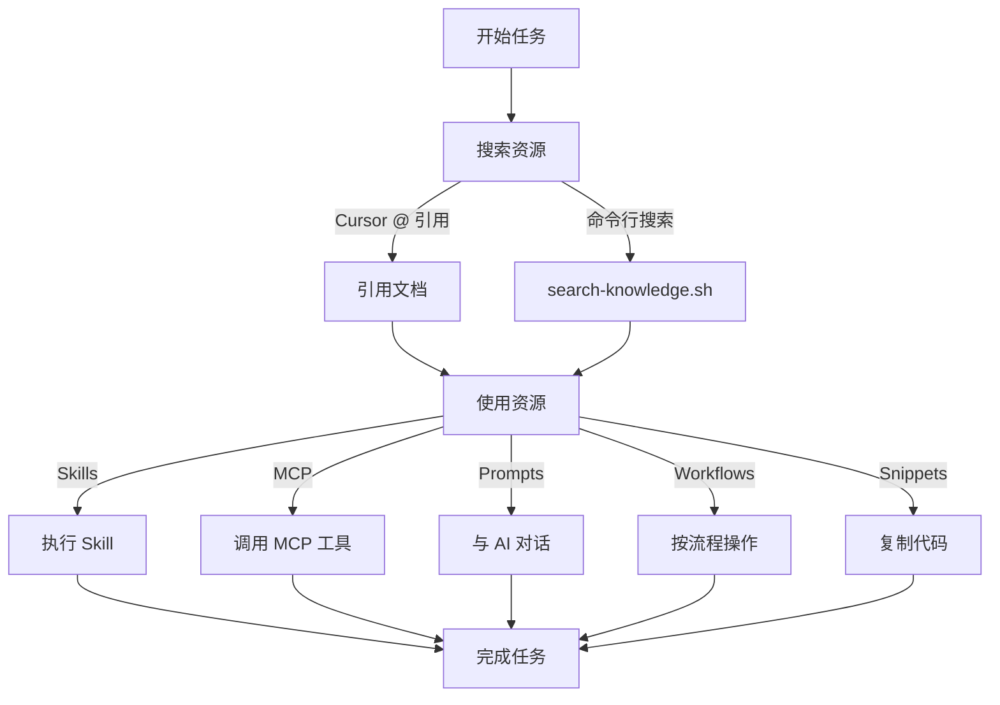

# 架构设计说明

深入了解 Jack Knowledge Hub 的设计理念、组织原则和技术实现。

## 🎯 设计目标

### 1. 混合模式
**既要实际集成，又要完整文档**

```
实际集成（Practical Integration）
├── skills/installed/        # 软链接到系统 Skills
├── mcp/active-servers.md    # 实时反映 MCP 配置
└── scripts/                 # 自动化工具

完整文档（Complete Documentation）
├── 每个资源的详细说明
├── 使用场景和示例代码
└── 最佳实践和注意事项
```

**优势**：
- 可以直接使用集成的工具
- 同时有完整的文档参考
- 即使工具变更，文档仍有价值

### 2. 三级组织
**类型 > 领域 > 频率**

```
📦 类型层（Type Layer）
   ├── skills/      - 功能分类
   ├── mcp/
   ├── prompts/
   ├── workflows/
   ├── snippets/
   └── resources/

📂 领域层（Domain Layer）
   ├── development/     - 应用场景
   ├── testing/
   ├── deployment/
   └── ...

⭐ 频率层（Frequency Layer）
   ├── frequently-used/     - 使用频率
   ├── occasionally-used/
   └── archived/
```

**优势**：
- 多维度分类，灵活查找
- 符合认知习惯
- 便于维护和扩展

### 3. Cursor 深度集成
**无缝融入 AI 辅助开发工作流**

- 使用 `@` 符号快速引用
- Prompt 模板直接对话使用
- Skills 和 MCP 即时可用
- 所有资源都是 Markdown 格式

## 📐 目录结构设计

### Skills 目录

```
skills/
├── README.md                    # 总览和索引
├── development/                 # 开发工具
│   ├── frequently-used/
│   │   ├── create-rule/        # 目录包含详细文档
│   │   ├── create-skill/
│   │   └── update-cursor-settings/
│   └── occasionally-used/
│       ├── migrate-to-skills/
│       └── create-subagent/
├── productivity/                # 效率工具
│   └── frequently-used/
│       └── skill-installer/
├── ai-workflow/                 # AI 工作流
│   └── frequently-used/
│       └── skill-creator/
└── installed/                   # 软链接（实际集成）
    ├── skill-creator -> /Users/jinzexu/.codex/skills/.system/skill-creator
    └── create-rule -> /Users/jinzexu/.cursor/skills-cursor/create-rule
```

**设计原则**：
- **文档目录**：按领域和频率组织，便于查找和学习
- **installed/ 目录**：软链接指向实际安装位置，保持同步
- **双重价值**：既有文档说明，又能直接使用

### MCP 目录

```
mcp/
├── README.md                    # MCP 概念和配置指南
├── active-servers.md            # 当前激活的 MCP 列表
├── location-services/           # 按服务类型分类
│   └── amap-maps/
│       ├── README.md           # 服务概览
│       ├── geocoding.md        # 地理编码功能
│       ├── search.md           # 搜索功能
│       ├── routing.md          # 路径规划
│       └── examples.md         # 使用示例
├── data-analysis/              # 预留：数据分析服务
└── web-scraping/               # 预留：网页抓取服务
```

**设计原则**：
- **按服务类型分类**：location-services、data-analysis 等
- **详细文档**：每个 MCP 的功能、参数、示例
- **实时同步**：active-servers.md 反映实际配置

### Prompts 目录

```
prompts/
├── README.md
├── coding/                      # 编码场景
│   ├── frequently-used/
│   │   ├── implement-feature.md
│   │   ├── code-review.md
│   │   └── test-generation.md
│   ├── occasionally-used/
│   └── archived/
├── debugging/                   # 调试场景
│   └── frequently-used/
│       ├── error-analysis.md
│       └── performance-optimization.md
├── refactoring/                 # 重构场景
└── documentation/               # 文档场景
```

**设计原则**：
- **按使用场景分类**：coding、debugging、refactoring 等
- **频率分级**：常用的快速访问，收藏的长期参考
- **模板格式**：统一结构，易于理解和使用

### Workflows 目录

```
workflows/
├── README.md
├── development/                 # 开发流程
│   └── frequently-used/
│       ├── feature-development.md
│       ├── bug-fixing.md
│       └── code-refactoring.md
├── testing/                     # 测试流程
│   └── frequently-used/
│       ├── unit-testing.md
│       └── integration-testing.md
└── deployment/                  # 部署流程
    └── frequently-used/
        ├── ci-cd-setup.md
        └── production-deployment.md
```

**设计原则**：
- **完整流程**：从开始到结束的完整步骤
- **检查清单**：确保不遗漏关键步骤
- **最佳实践**：经过验证的工作方法

### Snippets 目录

```
snippets/
├── README.md
├── javascript/                  # 按语言分类
│   ├── async-patterns.md
│   ├── error-handling.md
│   └── utility-functions.md
├── python/
│   ├── data-processing.md
│   └── file-operations.md
├── shell/
│   ├── git-aliases.md
│   └── system-admin.md
└── configs/                     # 配置文件
    ├── cursor-settings.json
    └── eslintrc.json
```

**设计原则**：
- **按语言分类**：便于查找相关代码
- **可复用性**：通用的、经过验证的代码片段
- **带注释**：解释用途和使用方法

### Resources 目录

```
resources/
├── README.md
├── documentation.md             # 官方文档链接
├── tutorials.md                 # 教程资源
├── tools.md                     # 工具集合
└── communities.md               # 社区资源
```

**设计原则**：
- **精选链接**：质量优先于数量
- **分类清晰**：文档、教程、工具、社区
- **定期更新**：保持链接有效性

## 🔄 数据流设计

### 资源同步流程

```mermaid
graph LR
    System[系统 Skills/MCP] -->|sync-resources.sh| Local[本地知识库]
    Local -->|软链接| Installed[installed/]
    Local -->|文档| Docs[各目录文档]
    Cursor[Cursor IDE] -->|@ 引用| Local
    User[用户] -->|使用| Cursor
```

### 使用流程



## 🛠️ 技术实现

### 软链接管理

```bash
# skills/installed/ 使用软链接
ln -s /Users/jinzexu/.codex/skills/.system/skill-creator \
      skills/installed/skill-creator

# 优势：
# 1. 保持与系统同步
# 2. 不占用额外空间
# 3. 更新自动生效
```

### 自动化脚本

```bash
# sync-resources.sh - 同步系统资源
# 1. 更新 Skills 软链接
# 2. 更新 MCP active-servers.md
# 3. 检查配置变更

# search-knowledge.sh - 全文搜索
# 1. 使用 ripgrep 快速搜索
# 2. 支持模糊匹配
# 3. 按频率排序结果
```

### 文档格式标准

```markdown
# 资源标题

## 概述
简短描述（1-2 句）

## 功能说明
详细功能列表

## 使用场景
何时使用这个资源

## 使用方法
### 基本用法
### 进阶用法

## 示例
具体的代码示例

## 参数说明（如适用）

## 注意事项

## 相关资源
- 链接到相关文档
```

## 📊 可扩展性

### 添加新类型

```bash
# 1. 创建顶层目录
mkdir new-type/

# 2. 按领域分类
mkdir new-type/{domain1,domain2}/

# 3. 按频率分级
mkdir new-type/domain1/{frequently-used,occasionally-used,archived}/

# 4. 创建 README.md
```

### 添加新领域

```bash
# 在现有类型下添加
mkdir skills/new-domain/
mkdir skills/new-domain/{frequently-used,occasionally-used,archived}/
```

### 调整频率分类

```bash
# 根据实际使用情况移动
mv prompts/coding/occasionally-used/my-prompt.md \
   prompts/coding/frequently-used/
```

## 🎨 设计权衡

### 优势
✅ 灵活的多维度分类
✅ 实际集成 + 完整文档
✅ 深度集成 Cursor 工作流
✅ 易于扩展和维护
✅ 支持个性化定制

### 挑战
⚠️ 需要定期维护频率分类
⚠️ 软链接在 Windows 上可能有兼容性问题
⚠️ 初始设置需要一定时间

### 解决方案
- 提供自动化脚本减少手动工作
- 使用相对路径增加可移植性
- 提供模板简化添加新资源

## 🔮 未来计划

- **智能推荐**：基于使用频率自动调整分类
- **版本控制**：记录资源的历史版本
- **团队协作**：支持团队共享知识库
- **搜索增强**：AI 辅助的语义搜索
- **统计分析**：资源使用情况可视化

---

继续阅读：[贡献指南](contributing.md) | 返回：[README](../README.md)
